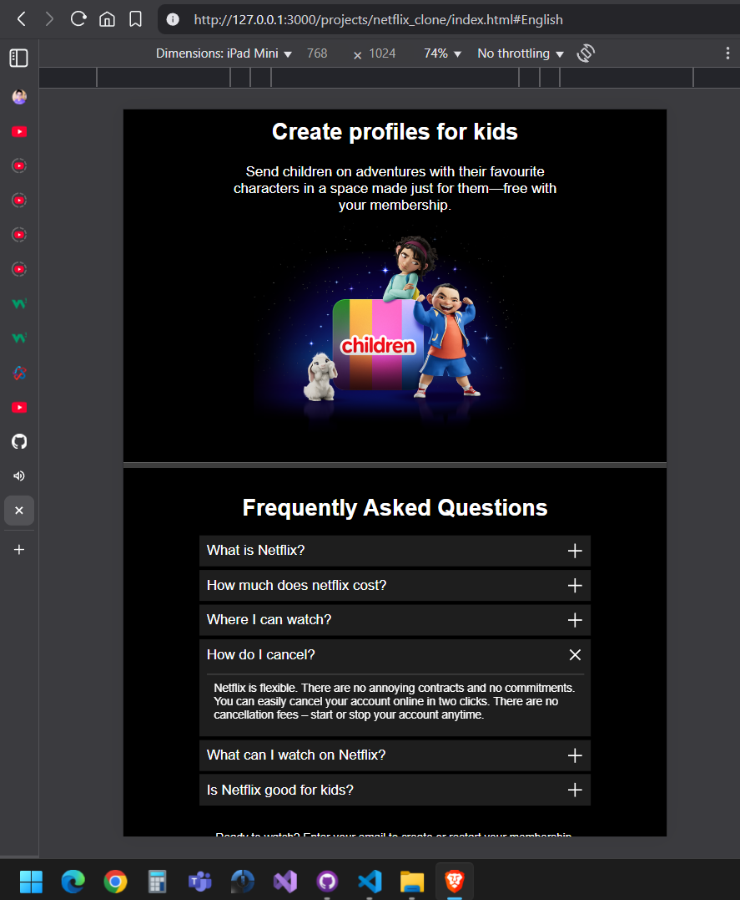

# Netflix Clone

A responsive **Netflix landing page clone** built using HTML and CSS, closely resembling the official Netflix homepage. This project is for educational and personal portfolio purposes only.

## 🚀 Features

- **Responsive Design:** Adjusts gracefully across desktops, tablets, and smartphones.
- **Modern Netflix UI:** Includes stylish hero section, flexible layout, and visual mimicry of the original streaming platform.
- **Device Compatibility:** Optimized for use on smart TVs, game consoles, streaming sticks, mobile devices, and desktops.
- **No Ads / Contracts:** Simulates the Netflix experience with smooth navigation, call-to-action areas, and a clear subscription workflow.
- **Kids Section Preview:** Highlights the dedicated kids’ profile section, featuring parental controls and family-friendly content.
- **Download Simulation:** Demonstrates features like offline download prompts and multi-device streaming (UI only).
- **Customizable FAQ Section:** Interactive dropdowns resemble the help/FAQ section on Netflix.


## 🛠️ Getting Started

1. **Clone the repository**
    ```sh
    git clone https://github.com/aryanbhanot05/Netflix_Clone.git
    ```

2. **Navigate to the project directory**
    ```sh
    cd Netflix_Clone    
    ```

3. **Open `index.html` in your web browser**

- You can double-click the file or open it using a live server extension for a better development experience.


## 📁 Project Structure

<pre><code> 
    Netflix_Clone/ 
    │ 
    ├── assets/ 
    │ ├── images/ 
    │ └── videos/ 
    │ 
    ├── index.html 
    ├── style.css 
    └── README.md
</code> </pre>

## 📸 Screenshots

Here are a few snapshots of the project.

**Desktop View**


**Mobile View**



## Key Sections

- **Header & Navigation:** Includes the Netflix logo, language selector, and sign-in button.
- **Hero Section:** Prominent call-to-action (CTA), email signup form, and service description.
- **Feature Descriptions:** Multiple sections illustrating usage on TVs, mobile, and more.
- **Kids & Download Areas:** Focus on downloadable content and kids’ profiles, using visual cues.
- **FAQ Accordion:** Expandable questions for a realistic help center experience.
- **Footer:** Useful links and secondary language selector.

## ✏️ Customization

- **Images:** Replace placeholder images in `assets/images/` to personalize the UI.
- **Content:** Update static texts and feature highlights in `index.html` as desired.
- **Styles:** Modify `style.css` for color schemes, animations, and layout tweaks.

## Responsiveness

- Uses multiple media queries to ensure adaptability across screen sizes.
- Mobile-friendly navigation and form controls.
- Grid and flex layouts for consistent alignment and spacing.


## ℹ️ Notes

- This is a **front-end only** clone. No backend, authentication, or real media streaming.
- All interactions (e.g., FAQ expand/collapse, form) are UI demonstration only.
- Feel free to modify or extend for your portfolio or learning!


## 📞 Contact

Aryan Bhanot - aryanbhanot05@gmail.com

LinkedIn: https://www.linkedin.com/in/aryan-bhanot-609650245/

Project Link: [https://github.com/aryanbhanot05/Netflix_Clone](https://github.com/aryanbhanot05/Netflix_Clone)